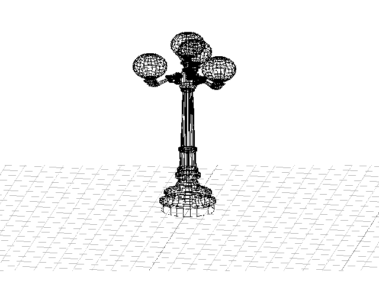

**The program allows you to open an .obj file and display the resulting model on the screen, as well as customize the resulting model**

* The program has a graphical user interface, based on the GUI library with API for C++ - "Qt 6.2.3"
* The program developed according to the principles of structured programming
* The code is written according to google style
* There can only be one model on the screen at a time

* The program provide the opportunity to:
  + Load a wireframe model from an obj file (vertices and surfaces list support only)
  + Move the model by a given distance in relation to the X, Y, Z axes
  + Rotate the model by a given angle relative to its X, Y, Z axes
  + Scale the model by a given value
  
* The graphical user interface contains:
  + Information about the loaded model - file name, number of vertices and edges
  + A button to select the file with the model
  + The model visualization area
  + Buttons and input fields for moving the model
  + Buttons and input fields for model rotation
  + Buttons and input fields for model scaling

  
* The program allows you to customize:
  + The program allows you to adjust the type of projection (parallel and central)
  + The program allows you to adjust the type (solid, dashed), color and thickness of the edges, display method (absent, circle, square), color and size of the vertices
  + The program allows you to choose the background color

* The settings are saved between program restarts

* The program must allow saving the captured (rendered) images as bmp and jpeg files.
* The program must allow recording small screencasts by a special button - the current custom affine transformation of the loaded object into gif-animation (640x480, 10fps, 5s)

*** 

This project was developed by a students of School 21: banefort, pipebomb, lightang